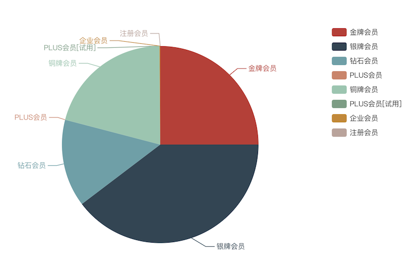
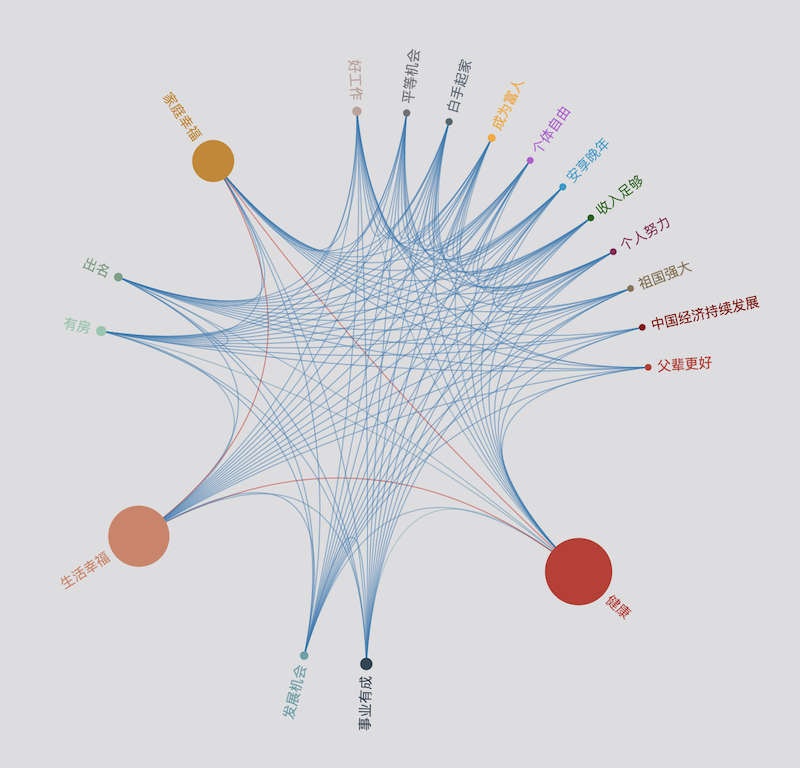

#### &ensp; &ensp; I am a Data Science postgraduate student of University of Edinburgh. I received my bachelor degree from Beihang University under supervision of Professor [Jichang Zhao](http://zhaojichang.cn/). My current work is about NLP and data visualization by python.

## Working Projects
### [Eagle Eye](http://101.200.54.165)
**flask** **echarts** 

### [China Dream Visualization](http://101.200.54.165:4345)
**flask** **echarts** 

---
## Working Papers

### Positive emotions can help rank negative reviews in e-commerce

